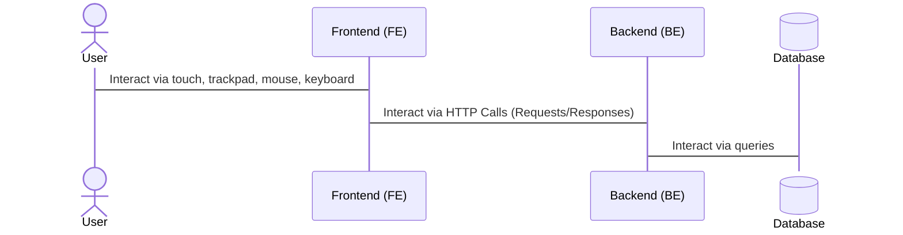

## About frontends

Frontends are the visual component of a web app, and users directly interact with it. It plays the role of an interface between the users and the actions they can perform within the app.

Frontends are apps which get downloaded in the browser of the user and the code gets executed on the spot. Actually *going to a URL* in the browser triggers this process of fetching the HTML, CSS and JS files which make up the frontend app. These provide the visual interface for users to usually interact with the backend.

### Single Page Applications (SPAs)

We will look at a certain architecture of frontend apps: **SPAs**. *Single page* refers to the fact that our project will only contain *1 HTML file (generally named `index.html`)*.

Historically, web *sites* used to be a collection of HTML files linked together via anchors (`<a>` elements), therefore the name *site* which is similar to e.g. archaeological site (a place with multiple archaeological artifacts).

The SPA model allows us to have a single document, contents of which we modify on the fly depending on where in our app the user navigates. E.g.:

Historically:
- `index.html` (homepage)
- `about.html` (linked to homepage)
- `contact.html` (linked to contact)

SPA model:
- `index.html` (homepage)
- user navigates to `/about` -> we *mount* the `About` *component* or *template* to the DOM of `index.html`
- user navigates to `/contact` -> we *mount* the `Contact` *component* or *template* to the DOM of `index.html`

> [> More about SPAs](https://developer.mozilla.org/en-US/docs/Glossary/SPA)

### Reactivity

An important concept in modern frontend apps is reactivity. That is the ability to handle changes in *state*. We call **state** the collection of variables that when either of them get changed, the frontend component needs to be able to handle this. Usually, *handling* refers to *updating* the DOM (aka updating the HTML template to contain the new values of the state).

The simplest example of reactivity is a frontned counter app: having a real-time updating number of clicks on a button on the screen. In this simple case, the state could be `numberOfClicks`, initialized with `0`, and every time a button is clicked, it gets `incremented`, cue-ing an update and having the template be displayed with the new value.

Generally, to achieve reactivity with plain simple (or, jargon *vanilla*) JS is quite verbose, and rather *frameworks* are used. *React*, *Vue* or *Angular* are all really popular frameworks which do allow out-of-the box reactivity to state, along many many more features.

The *framework* we will use though is [Arrow JS](https://www.arrow-js.com/). A small helper which will provide reactivity for us, similar to how *Express* made it easier for us to build backends with JS.

Another important concept is that for us, a unit of a frontend app is called a `component`. This is what we will spend time creating. These can vary from really a button, to entire pages. Components can be nested easily and are a way of wrapping logic and styles around the HTML elements they serve.

> [> Reactivity as seen in React...](https://react.dev/learn/adding-interactivity)

> [> Reactivity as seen with Arrow JS...](https://www.arrow-js.com/docs/)

### Lifecycle

All components have a lifecyle. The paradigm is the same in most frameworks, with small differences related to the name, but in general:

1. When the component gets **constructed** (imagine this as when the constructor is called on the component if it were a class)
2. When the component is **mounted** (when it is added to the DOM, when it becomes visible to the user)
3. When the component is **updated** (when the state changes and an update is performed on the template)
4. When the component is **unmounted** (when it's removed from the DOM, e.g. when the user navigates to a different part of the app)

All of these lifecycle moments we can **hook** on, and execute certain functions at certain points in time. E.g. when the component is **mounted**, we might want to perform an API call to update some state.

### In the lab

We scaffolded our first frontend project using the [**vite**](https://vite.dev/) build tool.

1. We ran `npm create vite@latest` in the parent directory, as vite is creating a child folder in which all the files will be written
2. From the menu, we selected `Vanilla` when we got asked about the framework and `JavaScript` when we got asked about a variant, other than that, we stuck with the default options suggested
3. Once the new directory was created, we opened it in Visual Studio Code
4. We opened a new terminal in that directory, and ran `npm install @arrow-js/core`, this will bring our helper in the picture
5. We deleted the `public` directory (this usually contains static images/icons that our app uses, not the case for us)
6. From the `src` directory, we deleted `counter.js`, `javascript.svg`, `style.css`, so that the only file left was `main.js` which we deleted everything from, so that it's empty.
7. We wrote all the code in `main.js`
8. We started the project by running `npm run dev` (this is nice also because it auto restarts when we change the code, so no need to stop and restart the app every time there's a small change)
