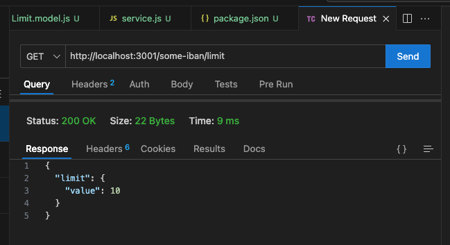
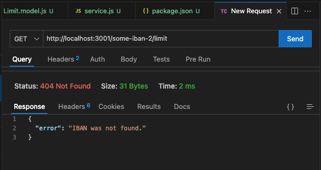

## Connect your API to a database

A **backend** is usually comprised of an API (similar to what we've built with Express in previous labs) and a database. Their communication is a key aspect.

The need for a database in APIs stems from having to store, query and manage data. If the application is of such a nature that **persistance** is needed, most likely a database should be used.

Instead of dealing with storing and querying arrays or objects, the application delegates this task to a database, which is specifically built to fulfill this scope.

### Types of databases

Main two types of databases in our scope are:
- *relational/SQL* (they store data in a structured form, we can think of that structure as a table with columns, where each row is an entry; the name suggests multiple relations can be built upon these tables in the same database) like **MySQL**, **SQLite**, **PostgreSQL**

> [> More about relational databases](https://cloud.google.com/learn/what-is-a-relational-database)

> [> MySQL](https://www.mysql.com/)

> [> SQLite](https://www.sqlite.org/)

> [> PostgreSQL](https://www.postgresql.org/)
- *non-relational/NoSQL* (they store data in an unstructured format, more like a dump of data; the application is responsible of populating the database correctly) like **MongoDB** or **Firebase's Firestore**

> [> More about NoSQL databases](https://cloud.google.com/discover/what-is-nosql)

> [> MongoDB](https://www.mongodb.com/)

> [> Firebase Firestore](https://firebase.google.com/docs/firestore)

In this lab we'll only take a look at *relational/SQL* databases.

In that scope, if we want to use a database within our application, we need to:
1. **Create the database** (specify the columns, the restraints, etc.)
2. **Populate / migrate data** (fill it in, optionally)
3. **Query it** (with *CRUD* operations)

All of the operations above can be done classically via **SQL Statements**, which we're familiar with:

```sql
SELECT * FROM ACCOUNTS;
-- returns a collection of rows from the ACCOUNTS table in the DB
```
```sql
UPDATE ACCOUNTS SET NAME="Not Mete" WHERE ID="some-account-id";
-- updates the NAME of the row associated to some-account-id to "Not Mete" in the ACCOUNTS table
```

Writing SQL Statements can get complicated, especially when multiple relations are involved. A solution which abstracts the SQL Statements and allows us to use more of a OOP approach is using **ORM (Object Relational Mapping)**.

### ORMs

For us, they're libraries we can install in our app and, e.g. the following SQL Statement:

```sql
SELECT * FROM ACCOUNTS;
```

can be written as:

```js
Account.findAll();
```

How they work is they construct an Object-like representation of the tables in the database, allowing for easier integration in applications. It also serves as somewhat of a security layer, since classic SQL Statements not carefully crafted could be open to SQL Injection.

> [> More about SQL Injection](https://owasp.org/www-community/attacks/SQL_Injection)

The one we'll use in the lab is `sequelize`. A lot of other options exist, for different types of databases, but this one is the most straight forward for JS. Different ORMs exist for different languages too.

It's really important to distinguish between a **database** and an **ORM**. The **ORM** is not more than an interface with a database, not the actual database itself.

> [> Official documentation of `sequelize@v6`](https://sequelize.org/docs/v6/getting-started/)

#### Creating a database with `sequelize`

*Creating* a database will actually mean creating the tables and populating it with initial data (optionally). We'll need to think about the structure of our tables and what we'll want to store.

A table in the context of an ORM is thought of as a **Model** (resembles a class with properties analogous to a table with columns).

```js
const Account = sequelize.define('Account', {
    id: { DataTypes.UUID, primaryKey: true },
    name: DataTypes.STRING,
    balance: DataTypes.NUMBER,
    currency: DataTypes.STRING,
});
```
Notice the `id` has type `UUID`, this stands for **Universal Unique Identifier** and is used as a scalable solution for uniquely identifying entries within a database. (an example would be `49eb07e3-28d1-4dd5-9ecd-de0288925e74`).

> Make sure you don't forget about the `.sync()` call to have the table created.

> [> More about `sequelize`'s data types](https://sequelize.org/docs/v6/core-concepts/model-basics/#data-types)

#### Migrating the data (optionally)

If the application already has persisted data, we can perform a **migration**. This usually means we bulk insert data in the database (imagine this happens for millions of entries).

> [> How Discord Stores Trillions of Messages: A Very Big Migration](https://discord.com/blog/how-discord-stores-trillions-of-messages#heading-5)

We can do this with `squelize` using the `.bulkCreate` method.

> [> More about creating in bulk with `sequelize`](https://sequelize.org/docs/v6/core-concepts/model-querying-basics/#creating-in-bulk)

#### Querying the data

With `sequelize` simple queries can be made via static methods which are part of the Model. A lot of possibilities exist there:
- getting a collection of all data in the table
```js
const queryResult = await Account.findAll();
// queryResult stores more information than the actual data
// we can find the data in queryResult.dataValues
const accounts = queryResult.map((item) => item.dataValues);
console.log(accounts);
```
- getting an entry via Primary Key
```js
const accountId = '49eb07e3-28d1-4dd5-9ecd-de0288925e74';
const queryResult = await Account.findByPk(accountId);
// in this case, queryResult can also be `undefined` when the
// respective ID is not found in the table
// so doing queryResult.dataValues would throw a TypeError
// we can use the optional chaining operator `?.` to just return
// `undefined` instead of throwing an error
// queryResult?.dataValues
console.log(queryResult?.dataValues);
```
- updating an account (the *resource*), not via a static method here
```js
const accountId = '49eb07e3-28d1-4dd5-9ecd-de0288925e74';
const account = await Account.findByPk(accountId);

// this will work for any update which
// changes the reference, pay careful attention
// to updating arrays/object
// where you'll need to use the spread operator probably
account.name = 'Not Mete';

await account.save();
```

> [> More about querying `sequelize` models](https://sequelize.org/docs/v6/core-concepts/model-querying-basics/)

### In the lab

We created a `Limit` model which would store limits of accounts and created a **database service** to query the database for them. Afterwards, we created an Express app with a `GET /:iban/limit` endpoint which which would use the database service to query the database for the limit of the IBAN passed in the **path params**.

Commands we ran:
1. `npm init` to initialize the npm package
2. `npm install sequelize sqlite3` to install sequelize and the database itself
3. `npm install express` to install the Express library

This time, instead of running `node index.js` for starting the app, we've added a new `script` in `package.json` which acts as an alias for the `node index.js` command, called `start`:

```json
"scripts": {
    "test": "echo \"Error: no test specified\" && exit 1",
    "start": "node index.js"
}
```

4. `npm start` to start the Express app

The other change we did in `package.json` is we added `"type": "module"`, which allows us to use the more common `import` and `export` statements instead of the `require` we've used until now.

#### Structure of the package

- [`./index.js`](./index.js) contains the API endpoint
- [`./db/db.js`](./db/db.js) contains the instantiation of the database
- [`./db/Limit.model.js`](./db/Limit.model.js) contains the *table definition*
- [`./db/service.js`](./db/service.js) exports functions which we can use in out endpoints

If we run the app:
- for a call to `GET http://localhost:3001/some-iban/limit` (IBAN which exists in the database)



- for a call to `GET http://localhost:3001/some-iban-2/limit` (IBAN which does not exist in the database)

